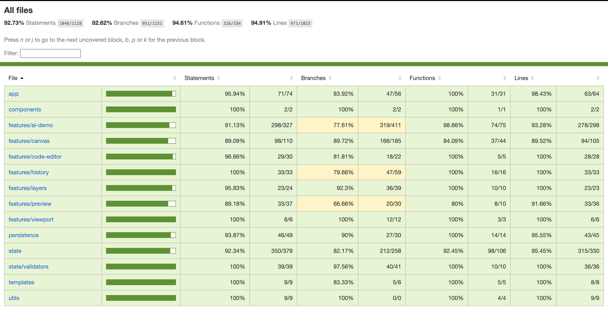

# Scope - Scoped AI Template Editor

A browser-based React and TypeScript prototype for bounded, recoverable editing of responsive website templates. It is designed for a non-technical business owner who needs to understand what will change before committing it.

## Run locally

Requirements: Node.js 20+ and npm.

```bash
npm ci
npm run dev
```

Open the URL printed by Vite. Quality commands:

```bash
npm run typecheck
npm test
npm run test:coverage
npm run test:ui
npm run lint
npm run build
```

`npm run test:ui` starts a local production preview at a test-only loopback URL. Set `PLAYWRIGHT_BASE_URL` to run the same browser suite against a deployed preview; the application itself contains no environment-specific URL.

## Run with Docker

```bash
docker build -t scope-editor .
docker run --rm -p 3000:3000 scope-editor
```

Open `http://localhost:3000`.

## CI and Vercel deployment

`.github/workflows/ci.yml` runs formatting, lint, types, coverage, production build, and Chromium UI tests on pull requests and pushes to `main`. Failed UI runs upload a Playwright report with traces and screenshots.

For continuous delivery, import the GitHub repository in Vercel and keep `main` as the Production Branch. Vercel then creates a preview deployment for each pull request and deploys merges to `main` to production.

## Verification evidence

The latest `npm run test:coverage` report:



## Deterministic demo examples

Select the stated target, choose the scope, and enter the instruction in the AI panel. Every result is a proposal until accepted.

| Required path | Example setup | Instruction |
| --- | --- | --- |
| Content rewrite | Select a text element | `Rewrite this to be friendlier` |
| Style change | Select any supported element | `Make it more prominent` |
| Resize | Select one element | `Make it bigger` |
| Reorder | Select one element, All Views | `Move this to the end` |
| One-viewport responsive edit | Select a container, Mobile | `Stack this on mobile` |
| Multi-element edit | Add two or more elements | `Make selected items compact` |
| Safe failure | Any selection | `Animate this with a spring` |

## Template source

Example Studio and Launch Dashboard are original fixtures generated for this exercise. No third-party template or real brand content is used. Google Fonts loads open-licensed Inter, Lora, and Playfair Display. Inter carries structural UI, Playfair Display carries editor and template headings, and Lora carries editorial template copy; no proprietary font file is bundled.

## Architecture and commit boundary

The editor uses one JSON-serializable document and one controlled path for changing it.

### Editing flow

1. **Canonical document:** Every element has a stable identity, type, parent, sibling order, shared properties, optional viewport-specific properties, and append-only history. Canvas and Code read and update this same document.
2. **Typed command:** Every manual edit, accepted AI proposal, or restore identifies its source, target elements, viewport scope, starting document version, and requested property changes.
3. **Validation gateway:** Before state can change, the editor checks the command shape, starting version, target existence, AI selection and scope, allowed fields, and valid values. Failure at any stage leaves the document unchanged.
4. **Responsive resolution:** The editor starts with shared properties and overlays only the exceptions stored for the active viewport. All Views changes shared values; Desktop, Tablet, or Mobile changes only its own layer.

### Commit boundary

A commit occurs only when a valid command causes a document change.

- **Before commit:** AI generation, proposal preview, saved-version preview, rejection, invalid input, and no-op actions do not change the document, persistence, version, or history.
- **On commit:** The editor advances the document version once, saves the canonical state, and appends exact before-and-after snapshots for every affected element and viewport layer.

### Recovery

- **Element restore:** Applies the exact layer stored by a chosen revision as a new validated change. It appends history instead of rewinding it and can remove a viewport exception so shared inheritance resumes.
- **Global save:** Save Version stores a complete page snapshot without duplicating each element's history. A session-end save is only a best-effort fallback.
- **Global restore:** Compares every shared layer, viewport layer, and sibling order, then validates and applies the full transaction or none of it. Success creates one document version, linked element revisions, and a new global checkpoint.

**Trade-off:** Creating, deleting, or moving an element to another parent cannot yet be recovered. Property layers and sibling order restore exactly while structural identity is unchanged; incompatible structure is rejected rather than partially reconstructed.

## Requirement map

| Assignment requirement | Implementation evidence |
| --- | --- |
| Typed serializable model | `src/state/types.ts`, `src/templates/` |
| Shared mutation gate | `src/state/pipeline.ts`, `src/state/validators/` |
| Stable additive selection | `StateContext.tsx`, `LayerList.tsx`, `Canvas.test.tsx` |
| Canvas/code consistency | `canvasEditToCommand.ts`, `parseAndDiff.ts`, reducer tests |
| Responsive scopes | `resolver.ts`, `ViewportSwitcher.tsx`, isolation tests |
| Deterministic selected-ID AI | `features/ai-demo/`, table-driven tests |
| Independent review | `ProposalReview.tsx`, proposal tests |
| Per-element recovery | `historyStore.ts`, `HistoryPanel.tsx`, history tests |
| Persistence/reset | `persistence/localStorage.ts`, persistence/UI tests |
| Keyboard/focus | Native controls, canvas options, dialog tests |
| One added product decision | Global history in `PRODUCT_NOTES.md` |

See [`PRODUCT_NOTES.md`](PRODUCT_NOTES.md) for the product policy, [`AI_USAGE.md`](AI_USAGE.md) for AI evidence and [`DESIGN.md`](DESIGN.md) for the visual contract.
